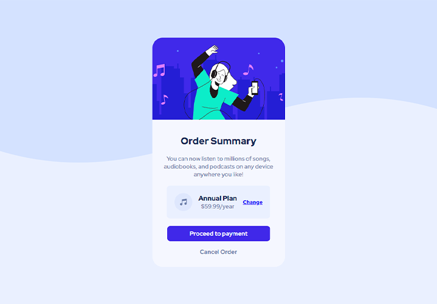

# Frontend Mentor - Order summary card solution

Esta é uma solução para o [Order summary card challenge on Frontend Mentor](https://www.frontendmentor.io/challenges/order-summary-component-QlPmajDUj).

### Screenshot

### Links

- Solution URL: [My solution URL here](https://github.com/Williamhsf/order-summary-component-main)
- Live Site URL: [My live site URL here](https://williamhsf.github.io/order-summary-component-main/)

## My process

### Built with

- Semantic HTML5 markup
- CSS custom properties
- Flexbox
- CSS Grid
- Mobile-first workflow

## Author

- [My linkedIn](https://www.linkedin.com/in/henriquewilliam/)
- [My Frontend Mentor](https://www.frontendmentor.io/profile/Williamhsf)

- [My Github](https://github.com/Williamhsf)